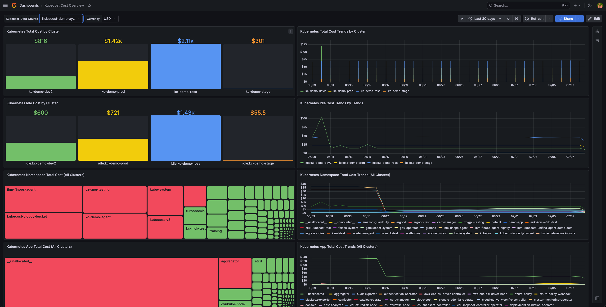
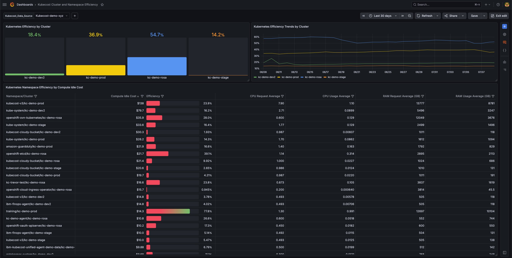
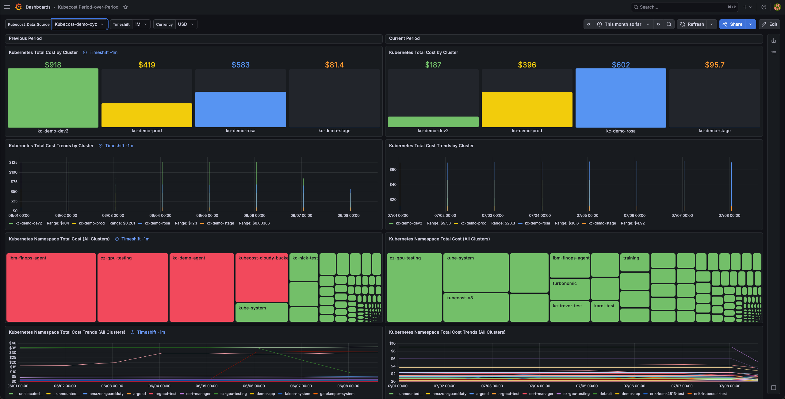
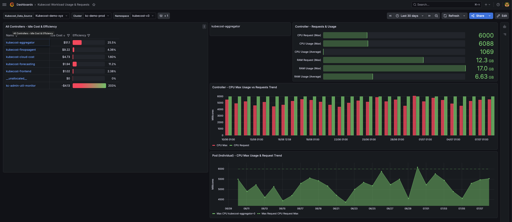

# Grafana Dashboard Templates

This directory contains Grafana dashboard templates for use with Kubecost v3. Each dashboard is directly integrated with the Kubecost APIs through the [Infinity plugin](https://grafana.com/grafana/plugins/yesoreyeram-infinity-datasource/), and is intended to serve as a foundation that teams can extend and customise for their own environments.

---

## Prerequisites

- **Grafana** v10+ (dashboards were built and tested on Grafana v13)
- **Infinity datasource plugin** (`yesoreyeram-infinity-datasource`) installed in your Grafana instance
- **Kubecost v3** deployed and accessible from the Grafana server (direct API access or via a proxy)

---

## Setup

### 1. Install the Infinity plugin

If the plugin is not already installed, add it via the Grafana CLI or the plugin catalogue:

```bash
grafana cli plugins install yesoreyeram-infinity-datasource
```

Restart Grafana after installation.

### 2. Add an Infinity datasource pointing at Kubecost

1. In Grafana, go to **Connections → Data sources → Add data source**.
2. Search for **Infinity** and select it.
3. Set the **Base URL** to your Kubecost API endpoint, e.g.:
   ```
   http://<kubecost-service>:<port>
   ```
   If Kubecost is in the same cluster as Grafana, the in-cluster service URL works directly (e.g. `http://kubecost-cost-analyzer.kubecost.svc.cluster.local:9090`). For out-of-cluster access, use an ingress URL or port-forward.
4. Configure any required authentication (bearer token, basic auth, etc.) under the **Auth** section.
5. Click **Save & test** to confirm connectivity.
6. Name the datasource — this name will be selectable from the `Kubecost_Data_Source` variable on each dashboard.

### 3. Import a dashboard

1. In Grafana, go to **Dashboards → Import**.
2. Click **Upload JSON file** and select the desired `.json` file from the [`dashboards/`](dashboards/) directory.
3. On the import screen, set the **Kubecost_Data_Source** variable to the Infinity datasource you created in step 2.
4. Click **Import**.

Repeat for each dashboard you want to use.

---

## Dashboards

### Kubecost Cost Overview

**File:** [`dashboards/kubecost-cost-overview.json`](dashboards/kubecost-cost-overview.json)



A high-level cost summary across your entire Kubernetes estate. Use this as the primary landing dashboard for finance and platform teams who need a quick view of where spend is going.

**Panels:**
| Panel | Description |
|---|---|
| Kubernetes Namespace Total Cost (All Clusters) | Current total cost ranked by namespace across all clusters |
| Kubernetes App Total Cost (All Clusters) | Current total cost ranked by app label across all clusters |
| Kubernetes Total Cost by Cluster | Current aggregated cost per cluster |
| Kubernetes Idle Cost by Cluster | Idle (wasted) compute cost broken out per cluster |
| Kubernetes Namespace Total Cost Trends (All Clusters) | Time-series cost trend per namespace |
| Kubernetes App Total Cost Trends (All Clusters) | Time-series cost trend per app label |
| Kubernetes Total Cost Trends by Cluster | Time-series cost trend per cluster |
| Kubernetes Idle Cost Trends by Cluster | Time-series idle cost trend per cluster |

**Variables:**
| Variable | Description |
|---|---|
| `Kubecost_Data_Source` | Infinity datasource connected to your Kubecost instance |
| `Currency` | Populated automatically from `/model/productConfigs`; reflects your configured Kubecost currency |

---

### Kubecost Cluster and Namespace Efficiency

**File:** [`dashboards/kubecost-cluster-namespace-efficiency.json`](dashboards/kubecost-cluster-namespace-efficiency.json)



Visualises resource efficiency — the ratio of used to requested compute — at both the cluster and namespace level. Helps identify over-provisioned workloads that are driving idle cost.

**Panels:**
| Panel | Description |
|---|---|
| Kubernetes Namespace Efficiency by Compute Idle Cost | Namespace efficiency ranked by associated idle cost |
| Kubernetes Efficiency by Cluster | Current efficiency score per cluster |
| Kubernetes Efficiency Trends by Cluster | Time-series efficiency trend per cluster |

**Variables:**
| Variable | Description |
|---|---|
| `Kubecost_Data_Source` | Infinity datasource connected to your Kubecost instance |

---

### Kubecost Period-over-Period

**File:** [`dashboards/kubecost-period-over-period.json`](dashboards/kubecost-period-over-period.json)



Compares cost and trends between two time windows — the current dashboard time range and a configurable prior period. Useful for budget reviews, sprint retrospectives, and detecting cost regressions.

**Panels:**
| Panel | Description |
|---|---|
| Current Period | Total cost for the active time range |
| Previous Period | Total cost for the shifted (prior) time range |
| Kubernetes Namespace Total Cost (All Clusters) | Namespace cost comparison across both periods |
| Kubernetes Total Cost by Cluster | Cluster cost comparison across both periods |
| Kubernetes Namespace Total Cost Trends (All Clusters) | Side-by-side namespace cost trends |
| Kubernetes Total Cost Trends by Cluster | Side-by-side cluster cost trends |

**Variables:**
| Variable | Description |
|---|---|
| `Kubecost_Data_Source` | Infinity datasource connected to your Kubecost instance |
| `Timeshift` | How far back the previous period starts; options: `1d`, `7d`, `14d`, `30d`, `1M`, `90d`, `1y` |
| `Currency` | Populated automatically from `/model/productConfigs` |

---

### Kubecost Workload Usage & Requests

**File:** [`dashboards/kubecost-workload-usage-requests.json`](dashboards/kubecost-workload-usage-requests.json)



Drills into CPU and memory usage versus requests for individual controllers and pods within a selected namespace. Use this to right-size workloads — identifying controllers that are over-requested (wasting money) or under-requested (risking performance).

**Panels:**
| Panel | Description |
|---|---|
| All Controllers — Idle Cost & Efficiency | Overview of idle cost and efficiency for all controllers in the selected namespace |
| Controller — CPU Max Usage vs Requests Trend | Time-series comparison of max CPU usage against configured CPU requests for the selected controller |
| Controller — Requests & Usage | Summary table of resource requests vs actual usage |
| Pod (Individual) — CPU Max Usage & Request Trend | Per-pod CPU usage vs request trend |

**Variables:**
| Variable | Description |
|---|---|
| `Kubecost_Data_Source` | Infinity datasource connected to your Kubecost instance |
| `Cluster` | Cluster to scope the view; populated dynamically via `/model/allocation/autocomplete` |
| `Namespace` | Namespace to scope the view; populated dynamically via `/model/allocation/autocomplete` |
| `Controller` | Controller (deployment, statefulset, etc.) to drill into; populated dynamically |

---

## Customisation

The dashboards are starting points, not finished products. Common customisations include:

- **Adding aggregations** — the Kubecost Allocation API supports grouping by `label`, `annotation`, `department`, `product`, `team`, and more. Duplicate an existing panel and change the `aggregate` query parameter.
- **Changing the time range** — all panels use Grafana's built-in `$__from` / `$__to` macros, so adjusting the dashboard time picker updates every query automatically.
- **Theming and layout** — panel colours, thresholds, and grid positions can be modified freely within the Grafana dashboard editor.

---

## Directory Structure

```
grafana/
├── dashboards/
│   ├── kubecost-cost-overview.json
│   ├── kubecost-cluster-namespace-efficiency.json
│   ├── kubecost-period-over-period.json
│   └── kubecost-workload-usage-requests.json
├── images/
│   ├── kubecost-cost-overview.png
│   ├── kubecost-cluster-namespace-efficiency.png
│   ├── kubecost-period-over-period.png
│   └── kubecost-workload-usage-requests.png
└── README.md
```
